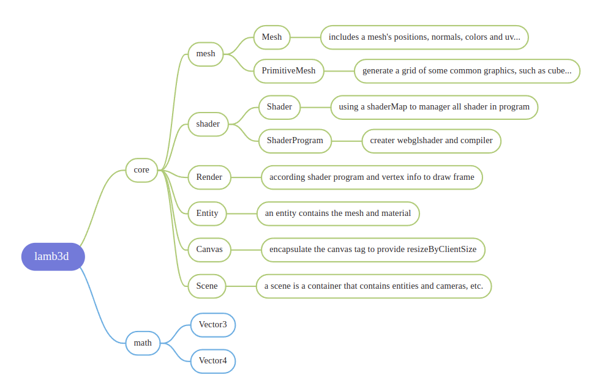
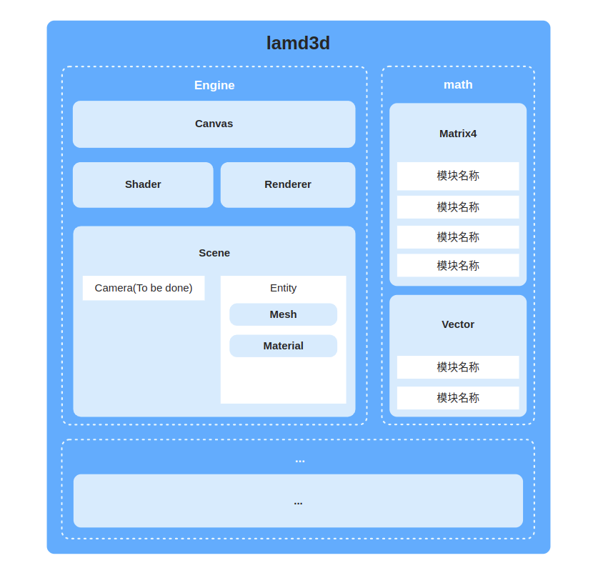

<!-- PROJECT LOGO -->
<br />
<p align="center">
  <h1 align="center">lamb3d</h1>
</p>

<!-- ABOUT THE PROJECT -->

# Introduction

A TypeScript 3d mini engine for gis.

# Architecture

The modules currently included in lamb3d are shown in the following figure:



The system architecture diagram of lamb3d is as follows:



# Usage

```js
import { Scene, PrimitiveMesh, Entity, Material, Shader } from '../dist/index.esm.js';

const engine = new Scene('gy');
const shader = initShader();
const material = new Material('feng', shader);
const mesh = PrimitiveMesh.createCuboid(0.5, 0.5, 0.5);
const entity = new Entity('cube1', mesh, material);
engine.addEntity(entity);
engine.run();

function initShader() {
  var VSHADER_SOURCE = 
  'attribute vec4 a_Position;\n' + 
  'void main() {\n' + 
  '  gl_Position = a_Position;\n' + 
  '}\n';

  // Fragment shader program
  var FSHADER_SOURCE =
  'precision mediump float;\n' + 
  'void main() {\n' + 
  '  gl_FragColor = vec4(0.5, 0.0, 0.0, 0.5);\n' + 
  '}\n';

  return Shader.create('cubeShader', VSHADER_SOURCE, FSHADER_SOURCE)
}
```

# Reference

- oasis : https://github.com/oasis-engine/engine

- cesium: https://github.com/CesiumGS/cesium

- MadDream3D: https://github.com/bajieSummer/MadDream3D
