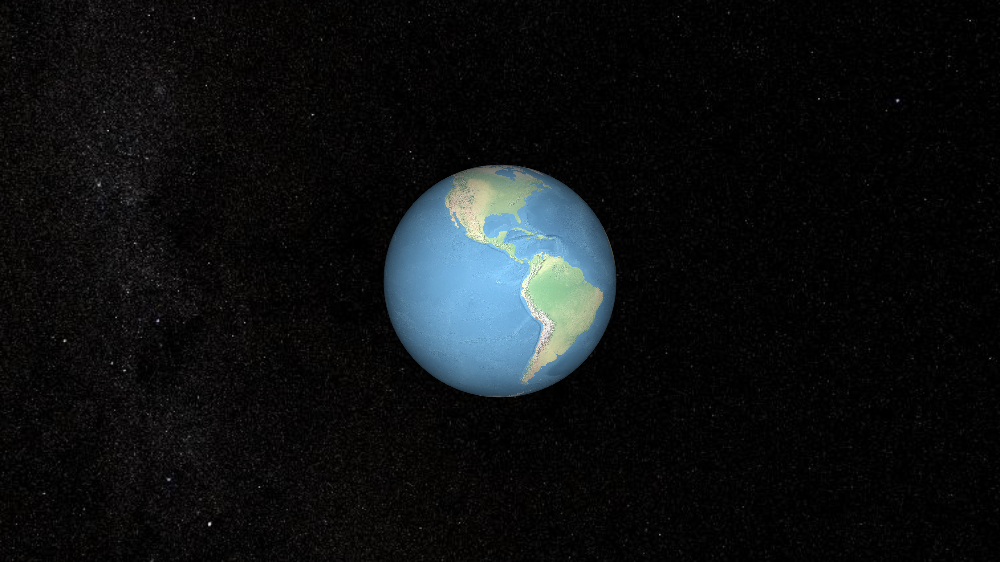

<!-- PROJECT LOGO -->
<br />
<p align="center">
  <h1 align="center">lamb3d</h1>
</p>

<!-- ABOUT THE PROJECT -->

# Introduction

A 3d gis engine written in TypeScript and WebAssembly.

# Document

Here you can see [engine documentation](https://www.yuque.com/shengaoyang-rl1fl/apm3zh), mind maps, system architecture and my brainstorming!

# Architecture

The modules currently included in lamb3d are shown in the following figure:


The system architecture diagram of lamb3d is as follows:


# Usage



```js
import { Engine, Scene, PrimitiveMesh, Entity, ImageMaterial, Shader, Camera, Vector3 } from '../dist/index.esm.js';

const lamb3d = new Engine('gy');
const camera = new Camera(lamb3d);
camera.transform.position = new Vector3(0, 0, 3);

camera.transform.lookAt(new Vector3(0, 0, 0));
lamb3d.activeScene.camera = camera;

const shader = initShader('CustomShader');
const material = new ImageMaterial(lamb3d, shader);

const mesh = PrimitiveMesh.createSphereByParamEquation(lamb3d, 1, 40);
const entity = new Entity('Sphere1', mesh, material);

lamb3d.activeScene.addEntity(entity);
lamb3d.run();

function initShader(name) {
  var VSHADER_SOURCE = 
  'attribute vec3 POSITION;\n' + 
  'attribute vec3 NORMAL;\n' +
  'attribute vec2 TEXCOORD_0;\n' +

  'uniform mat4 u_viewMat;\n' + 
  'uniform mat4 u_projMat;\n' + 

  'varying vec3 v_worldPostion;\n' +  
  'varying vec2 v_TexCoord;\n' +

  'void main() {\n' + 
  '  gl_Position = u_projMat * u_viewMat * vec4(POSITION, 1.0);\n' + 

  '  v_worldPostion = POSITION;\n' + 
  '  v_TexCoord = TEXCOORD_0;\n' +
  '}\n';

  // Fragment shader program
  var FSHADER_SOURCE =
  'precision mediump float;\n' + 

  'varying vec3 v_worldPostion;\n' + 
  'varying vec2 v_TexCoord;\n' +

  'uniform sampler2D u_Sampler;\n' + 
  'uniform vec3 u_pointLightPosition;\n' + 
  'uniform vec3 u_pointLightColor;\n' + 
  'uniform vec3 u_ambientightColor;\n' + 

  'void main() {\n' + 
  '  vec3 normal = normalize(v_worldPostion);\n' + 
  '  vec3 lightDirection = normalize(u_pointLightPosition - v_worldPostion);\n' +
  '  float nDotL = max(dot(lightDirection, normal), 0.0);\n' +
  '  vec4 textureColor = texture2D(u_Sampler, v_TexCoord);\n' +
  '  vec3 diffuse = u_pointLightColor * textureColor.rgb * nDotL;\n' +
  '  vec3 ambient = u_ambientightColor * textureColor.rgb;\n' +
  '  gl_FragColor = vec4(diffuse + ambient, textureColor.a);\n' + 
  // '  gl_FragColor = textureColor;\n' + 
  '}\n';

  return Shader.create(name, VSHADER_SOURCE, FSHADER_SOURCE)
}
```

# Reference

- oasis : https://github.com/oasis-engine/engine

- cesium: https://github.com/CesiumGS/cesium

- MadDream3D: https://github.com/bajieSummer/MadDream3D
