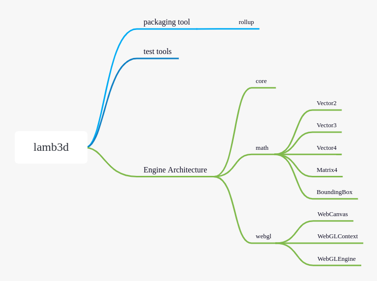

<!-- PROJECT LOGO -->
 

  <!--  -->
  <h1 align="center">lamb3d</h1>

<!-- ABOUT THE PROJECT -->

# Introduction

A javascript 3d mini engine for gis.

# Architecture

# Reference

- oasis : https://github.com/oasis-engine/engine

- cesium: https://github.com/CesiumGS/cesium

- MadDream3D: https://github.com/bajieSummer/MadDream3D